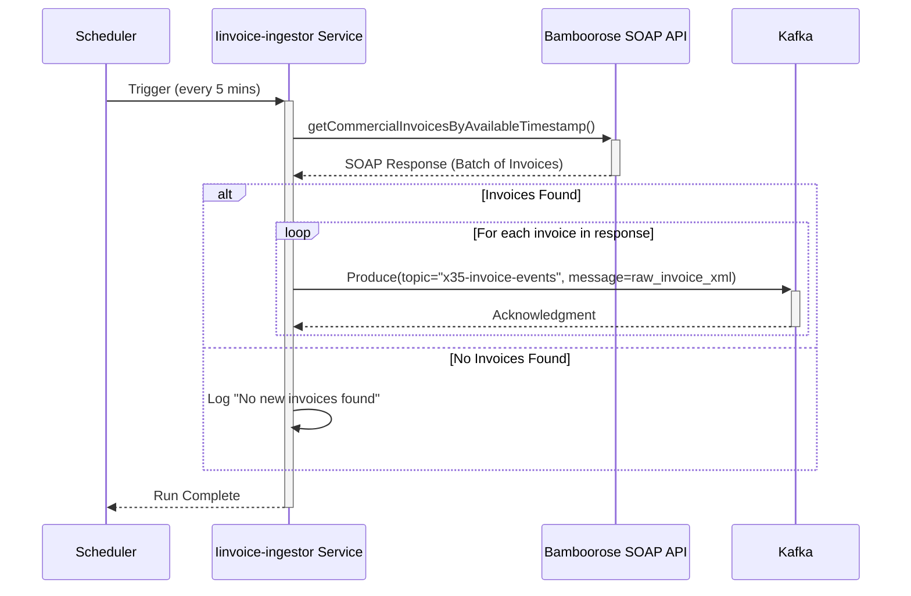
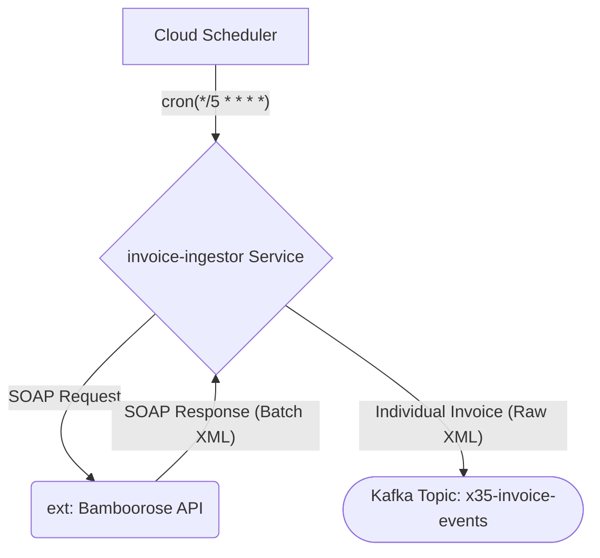

# Service Design: invoice-ingestor

## Metadata
- Generated: 2025-12-23
- Version: 1.0
- Prompt Version: 2.0
- Gemini CLI: 0.21.2

## 1. Introduction
This document details the software design for the `invoice-ingestor` microservice, a component of the larger Invoice-to-IP modernization effort. This service functionally replaces the TIBCO process `Invoice_To_IP_TimerProcess.process`. The primary goal of this service is to create a reliable and scalable ingestion point for invoice data from the external Bamboorose SOAP API, decoupling the data acquisition from subsequent processing steps within the x35 ecosystem. The scope is limited to fetching and publishing raw invoice data.

## 2. Service Overview
The `invoice-ingestor` is a cloud-native microservice responsible for polling an external SOAP API and ingesting invoice data into the x35 platform. It is a non-stateful service triggered on a recurring schedule by Cloud Scheduler. Upon activation, it calls the `getCommercialInvoicesByAvailableTimestamp` method of the Bamboorose SOAP service. If the response contains invoice records, the service iterates through the batch and publishes each invoice individually as a raw XML message to the `x35-invoice-events` Kafka topic. This ensures that downstream services can process invoices independently.

## 3. High-Level Design & Process Flow

This section details the operational workflow of the `invoice-ingestor` service, from its scheduled trigger to the successful publishing of invoice data.

### 3.1 Process Steps
1.  **Scheduled Trigger**: The process is initiated by a Cloud Scheduler job configured to run every five minutes.
2.  **Fetch Invoices**: The service constructs and sends a SOAP request to the Bamboorose API's `getCommercialInvoicesByAvailableTimestamp` endpoint. The request includes credentials and the last successful polling timestamp to fetch only new or updated invoices.
3.  **Check for Records**: The service inspects the SOAP response. If the response indicates "No records found" or is empty, the process logs this information and terminates successfully for this cycle.
4.  **Parse and Iterate**: If the response contains invoice data, the service parses the XML payload to identify individual invoice records. It then begins a loop to process each invoice one by one.
5.  **Publish to Kafka**: For each invoice in the loop, the service creates a new Kafka message. The entire raw XML for that single invoice is placed in the message body. The message is then published to the `x35-invoice-events` Kafka topic.
6.  **Completion**: After all invoices from the batch have been published, the service logs a summary (e.g., "Published 15 invoices") and terminates its run. Errors during the publishing of any single invoice are logged, but the service attempts to continue with the remaining invoices in the batch.

### 3.2 Sequence Diagram



### 3.3 Data Flow Diagram


## 4. API Specification

As the `invoice-ingestor` service does not expose any incoming APIs, this section details the specification for the outbound SOAP web service call it makes to the external Bamboorose system.

### Bamboorose Commercial Invoice Service

-   **Endpoint**: The service endpoint URL is not hardcoded and will be supplied via an environment variable. Example: `https://urban.bamboorose.com:443/test/services/ServiceHandler.ServiceHandlerHttpSoap11Endpoint/`
-   **Method**: `POST`
-   **Authentication**: The service will use Basic Authentication, with the username and password supplied via environment variables.

#### **Operation: `getCommercialInvoicesByAvailableTimestamp`**

-   **Business Logic Summary**: This operation is invoked to retrieve a batch of commercial invoices that have become available since the last successful poll. The service will maintain the state of the `availableTimestamp` to ensure it only fetches new records.

-   **Request**:
    -   **Headers**:
        -   `Content-Type`: `text/xml; charset=utf-t-8`
        -   `SOAPAction`: `"getCommercialInvoicesByAvailableTimestamp"`
    -   **Body Schema (SOAP Envelope)**: The request body will be an XML payload containing the necessary credentials and the timestamp for the query.
        ```xml
        <soapenv:Envelope xmlns:soapenv="http://schemas.xmlsoap.org/soap/envelope/" xmlns:ser="http://services.bamboorose.com">
           <soapenv:Header/>
           <soapenv:Body>
              <ser:getCommercialInvoicesByAvailableTimestamp>
                 <ser:userName>[USERNAME]</ser:userName>
                 <ser:password>[REDACTED]</ser:password>
                 <ser:availableTimestamp>?</ser:availableTimestamp>
              </ser:getCommercialInvoicesByAvailableTimestamp>
           </soapenv:Body>
        </soapenv:Envelope>
        ```

-   **Responses**:
    -   **Success Response (`200 OK`)**:
        -   **Body Schema**: A successful response contains a SOAP envelope where the `return` element holds an XML document string. This string contains the batch of invoices, conforming to the `invoiceschema_V2.xsd`.
            ```xml
            <soapenv:Envelope xmlns:soapenv="http://schemas.xmlsoap.org/soap/envelope/">
               <soapenv:Body>
                  <ns1:getCommercialInvoicesByAvailableTimestampResponse xmlns:ns1="http://services.bamboorose.com">
                     <ns1:return><![CDATA[<?xml version='1.0' encoding='UTF-8'?>
                        <document>
                            <!-- one or more invoice records -->
                        </document>
                     ]]></ns1:return>
                  </ns1:getCommercialInvoicesByAvailableTimestampResponse>
               </soapenv:Body>
            </soapenv:Envelope>
            ```
    -   **Error Responses**: The service should anticipate standard HTTP error codes (e.g., `401 Unauthorized`, `500 Internal Server Error`, `503 Service Unavailable`) and handle them appropriately by logging the error and retrying according to the resilience strategy.

## 5. Data Models & Schemas

This section defines the data structures and schemas used by the `invoice-ingestor` service. The primary data model is the Kafka message schema for the outbound topic.

### 5.1 Input Data Format
The input data for this service is the raw XML response from the Bamboorose SOAP API. The schema for this data is externally defined by the `invoiceschema_V2.xsd`. The service will not perform validation against this schema but will treat the payload as opaque XML.

### 5.2 Canonical Data Model
The `invoice-ingestor` service does not use an internal canonical data model. It directly transfers the raw invoice XML from the source system to the Kafka topic without transformation, acting as a pass-through component.

### 5.3 Kafka Message Schema

-   **Topic Name**: `x35-invoice-events`
-   **Partitioning Key**: No specific key will be used. Messages will be published to partitions in a round-robin fashion to ensure even distribution.
-   **Schema**:
    -   **Message Body**: The body of the Kafka message will be the raw, complete XML string for a single invoice record, encoded in UTF-8.
    -   **Headers**: No custom application-specific headers will be added at this stage. A `trace_id` will be included for observability, following x35 standards.

## 6. Technical Stack & Libraries

This section specifies the programming language, version, and key libraries required to build and run the `invoice-ingestor` service, consistent with the x35 platform standards.

-   **Python Version**: 3.11

### 6.1 x35 Core Libraries

-   **`x35-fastapi`**: Used as the standard application builder to provide a consistent structure and lifecycle management, even though no HTTP endpoints are exposed. The `on_startup` event will be used to initialize clients.
-   **`x35-settings`**: Manages all application configuration sourced from environment variables, including API endpoints, credentials, and Kafka connection details.
-   **`x35-json-logging`**: Provides structured JSON logging for all service events, compatible with the GCP logging stack.
-   **`urbn-confluent-methods`**: Simplifies interaction with the Kafka cluster, used here to implement the Kafka producer for publishing raw invoice messages.
-   **`x35-errors`**: Provides standardized exception classes for consistent error handling.

### 6.2 External Libraries

-   **`httpx`**: The preferred asynchronous HTTP client for making the outbound SOAP API call to Bamboorose.
-   **`lxml`**: Used to efficiently parse the batch XML response from the SOAP API to iterate through individual invoice records.
-   **`backoff`**: Will be used to implement a retry mechanism with exponential backoff for the SOAP API call, enhancing resilience against transient network or service failures.

## 7. Configuration

All configuration for the `invoice-ingestor` service will be managed via environment variables, adhering to the principles of a 12-factor app. The `x35-settings` library will be used to load and validate these variables.

### 7.1 Environment Variables

| Environment Variable | Type | Default | Description |
| :--- | :--- | :--- | :--- |
| `LOG_LEVEL` | String | `INFO` | The logging level for the application (e.g., DEBUG, INFO, WARNING, ERROR). |
| `BAMBOOROSE_API_URL` | String | (Required) | The full endpoint URL for the Bamboorose SOAP API. |
| `BAMBOOROSE_API_USERNAME`| String | (Required) | The username for authenticating with the Bamboorose SOAP API. |
| `BAMBOOROSE_API_PASSWORD`| Secret | (Required) | The password for authenticating with the Bamboorose SOAP API. Stored in Secret Manager and injected as an environment variable. Represented as `[REDACTED]` in logs. |
| `BAMBOOROSE_API_TIMEOUT` | Integer | `60` | The timeout in seconds for the SOAP API request. |
| `KAFKA_BOOTSTRAP_SERVERS`| String | (Required) | Comma-separated list of Kafka broker addresses (e.g., `kafka-1:9092,kafka-2:9092`). |
| `KAFKA_PRODUCER_TOPIC` | String | `x35-invoice-events` | The Kafka topic where raw invoice messages will be published. |
| `KAFKA_SECURITY_PROTOCOL`| String | `SASL_SSL` | The security protocol for connecting to Kafka. |
| `KAFKA_SASL_MECHANISM` | String | `PLAIN` | The SASL mechanism for Kafka authentication. |
| `KAFKA_SASL_USERNAME` | String | (Required) | The username for Kafka authentication. |
| `KAFKA_SASL_PASSWORD` | Secret | (Required) | The password for Kafka authentication. Stored in Secret Manager and injected as an environment variable. Represented as `[REDACTED]` in logs. |
| `SCHEDULER_CRON` | String | `*/5 * * * *` | The cron expression defining the service's execution schedule. (Note: This is for reference; the actual trigger is external in Cloud Scheduler). |

### 7.2 Config Files
No file-based configuration will be used.

### 7.3 External Connections

-   **Bamboorose SOAP API**:
    -   **System**: Bamboorose
    -   **Type**: Outbound SOAP API
    -   **Details**: Connection details are managed via the `BAMBOOROSE_API_*` environment variables.
-   **Confluent Kafka**:
    -   **System**: x35 Kafka Cluster
    -   **Type**: Messaging Broker
    -   **Details**: Connection details are managed via the `KAFKA_*` environment variables.

## 8. Error Handling & Resilience

This section outlines the strategies for handling errors and ensuring the resilience of the `invoice-ingestor` service. The primary goals are to prevent data loss, handle transient failures gracefully, and provide clear diagnostics for operational issues.

### 8.1 System Errors

-   **Bamboorose API Unavailability**:
    -   **Detection**: `httpx` will raise a `ConnectError`, `TimeoutException`, or a non-2xx HTTP status code (`500`, `503`, etc.).
    -   **Handling Strategy**:
        1.  The error will be logged with `severity: "ERROR"` and will include the `trace_id` and relevant details (URL, status code).
        2.  A retry mechanism with exponential backoff (using the `backoff` library) will be applied to the API call. The service will attempt up to 5 retries over a period of approximately 5 minutes.
        3.  If all retries fail, the service will log a `severity: "CRITICAL"` message and terminate its current run. No data will be sent to Kafka. The issue will be automatically addressed by the next scheduled run.

-   **Kafka Unavailability**:
    -   **Detection**: The `urbn-confluent-methods` producer will raise a `KafkaException` if it cannot connect to the bootstrap servers or if a message fails to be produced after its internal retries.
    -   **Handling Strategy**:
        1.  If the Kafka producer fails to initialize during startup, the service will log a `severity: "CRITICAL"` error and shut down.
        2.  If a message fails to be published during the main processing loop, the error will be logged with `severity: "ERROR"`. The service will attempt to continue processing and publishing the remaining invoices from the current batch.
        3.  A metric counter (`kafka_produce_failures_total`) will be incremented for each failed message, enabling alerting on persistent publishing issues.

### 8.2 Data Errors

-   **Invalid SOAP Response (XML Parsing Error)**:
    -   **Detection**: An exception will be raised by the `lxml` parser if the response from the Bamboorose API is not well-formed XML.
    -   **Handling Strategy**: The service will log a `severity: "ERROR"` message, including the `trace_id` and a snippet of the invalid response. It will not retry the request, as this indicates a data issue, not a transient failure. The service will terminate its run, and an alert will be triggered based on the log message.

-   **"No Records Found" Response**:
    -   **Detection**: The service logic will explicitly check if the parsed SOAP response contains any invoice records.
    -   **Handling Strategy**: This is considered a normal operational scenario. The event will be logged with `severity: "INFO"`, and the service will terminate its run successfully.

### 8.3 Resilience Patterns

-   **Retry**: The outbound SOAP API call will be wrapped in a retry pattern with exponential backoff to handle transient network or service availability issues.
-   **Timeout**: A request timeout (configured via `BAMBOOROSE_API_TIMEOUT`) will be applied to all calls to the Bamboorose API to prevent the service from hanging on an unresponsive connection.
-   **Statelessness**: The service is designed to be completely stateless. It does not store any data locally between runs. This allows it to be safely stopped and restarted by the scheduler or an orchestrator without risk of data corruption. The state of the last processed invoice is managed by querying the Bamboorose API with a timestamp.

## 9. Observability

To ensure the `invoice-ingestor` service is transparent and supportable in production, it will incorporate standardized logging, metrics, and tracing as described below.

### 9.1 Logging

All log output will be structured JSON, generated by the `x35-json-logging` library. Key logging events will include:

-   **Service Start/End**: `INFO` level logs to indicate when a scheduled run begins and ends, including the `trace_id`.
-   **API Call**: `INFO` level log before making the SOAP API call, including the target URL.
-   **API Response**: `INFO` level log upon receiving a successful API response. A separate `DEBUG` level log will capture the full response payload if more detailed tracing is required.
-   **No Invoices Found**: `INFO` level log for the normal scenario where no new invoices are returned.
-   **Invoice Publishing**: `INFO` level log for each invoice published to Kafka, including the topic name.
-   **Summary**: `INFO` level log at the end of a successful run, summarizing the number of invoices published (e.g., `msg: "Successfully published 42 invoices"`).
-   **Errors**: `ERROR` or `CRITICAL` level logs for all handled exceptions (API failures, Kafka failures, parsing errors), including stack traces and relevant context.

### 9.2 Metrics

The service will expose a `/metrics` endpoint for Prometheus scraping. Key application-level metrics will include:

-   **`invoices_fetched_total` (Counter)**: The total number of individual invoices fetched from the Bamboorose API.
-   **`invoices_published_total` (Counter)**: The total number of invoices successfully published to Kafka.
-   **`bamboorose_api_requests_total` (Counter)**: The total number of requests made to the Bamboorose API. Labels: `outcome` ("success", "failure").
-   **`bamboorose_api_request_duration_seconds` (Histogram)**: The latency of requests to the Bamboorose API.
-   **`kafka_produce_failures_total` (Counter)**: A counter that increments each time a message fails to be produced to Kafka after all internal retries.

### 9.3 Tracing

Distributed tracing will be enabled. A `trace_id` will be generated at the start of each scheduled run. This `trace_id` will be:

-   Included in all structured logs generated by the service.
-   Added as a header to the Kafka messages published to the `x35-invoice-events` topic.

This allows for the end-to-end tracing of an invoice's journey, from its initial ingestion by this service through all subsequent processing stages in the downstream microservices. Key spans will include the SOAP API call and the Kafka publish loop.
